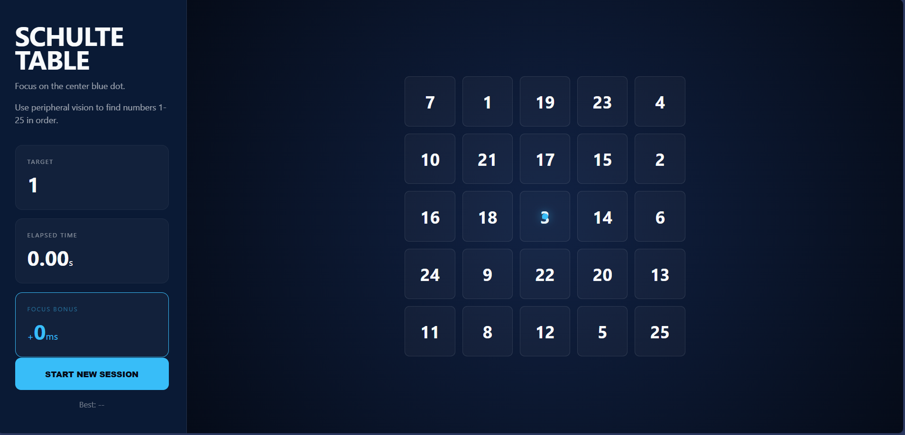

# 🧠 Schulte Table: Peripheral Vision Trainer



A high-performance cognitive training tool designed to improve peripheral vision...
A high-performance cognitive training tool designed to improve peripheral vision, attention span, and reading speed. 

## 🎯 How It Works
The objective is to find and click numbers 1 through 25 in ascending order as quickly as possible. To get the maximum benefit, you must keep your eyes locked on the **center blue dot** and use your peripheral vision to locate the numbers.

## ✨ Features
* **Immersive Dashboard:** A dedicated side panel for live stats and instructions.
* **Peripheral Reward System:** Earn "Focus Bonuses" for quick consecutive hits, rewarding peripheral awareness over eye scanning.
* **Responsive Grid:** Scales perfectly to fit laptop and desktop screens.
* **Performance Overlay:** Instant session summary including adjusted time and personal records.
* **Visual Feedback:** Shake animations and error highlights for incorrect clicks.

## 🚀 Technical Stack
* **HTML5:** Semantic structure with a dedicated sidebar/main area.
* **CSS3:** Flexbox and CSS Grid for a responsive, dashboard-style layout.
* **JavaScript (ES6):** Logic for shuffling, timer synchronization, and `localStorage` integration for personal bests.

## 🕹️ Live Demo
[Check out your hosted trainer here!](https://geosteam36.github.io/Schulte-Table-Demo-/)

## 🛠️ Installation & Setup
1. Clone the repository:
   ```bash
   git clone [https://github.com/YOUR_USERNAME/schulte-table-trainer.git](https://github.com/YOUR_USERNAME/schulte-table-trainer.git)